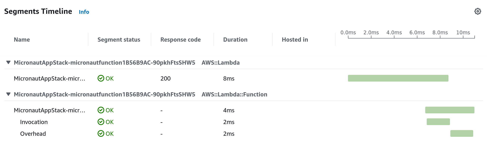

[](https://github.com/wyattconsulting/micronaut-java-graal-lambda/actions/workflows/actions.yml) [](https://github.com/wyattconsulting/micronaut-java-graal-lambda/actions/workflows/codeql.yml)

## Micronaut 4.2.3 Documentation

- [User Guide](https://docs.micronaut.io/4.2.3/guide/index.html)
- [API Reference](https://docs.micronaut.io/4.2.3/api/index.html)
- [Configuration Reference](https://docs.micronaut.io/4.2.3/guide/configurationreference.html)
- [Micronaut Guides](https://guides.micronaut.io/index.html)
---

## Deployment with GraalVM

If you want to deploy to AWS Lambda as a GraalVM native image, run:

```bash
./gradlew buildNativeLambda -Pmicronaut.runtime=lambda
```

This will build the GraalVM native image inside a docker container and generate the `function.zip` ready for the deployment.


## Handler

Handler: com.example.FunctionRequestHandler

[AWS Lambda Handler](https://docs.aws.amazon.com/lambda/latest/dg/java-handler.html)

## Requisites

- [AWS Account](https://aws.amazon.com/free/)
- [CDK CLI](https://docs.aws.amazon.com/cdk/v2/guide/cli.html)
- [AWS CLI](https://aws.amazon.com/cli/)

## How to deploy

### Generate the deployable artifact

```
./gradlew :app:buildNativeLambda
./gradlew test
```

### Deploy

The `infra/cdk.json` file tells the CDK Toolkit how to execute your app.

`cdk diff` - compare deployed stack with current state

`cdk synth` - emits the synthesized CloudFormation template

`cdk deploy` - deploy this stack to your default AWS account/region

`cdk docs` - open CDK documentation

### Cleanup

```
cd infra
cdk destroy
cd ..
```

### Example X-Ray Trace


- [Shadow Gradle Plugin](https://plugins.gradle.org/plugin/com.github.johnrengelman.shadow)
- [Micronaut Gradle Plugin documentation](https://micronaut-projects.github.io/micronaut-gradle-plugin/latest/)
- [GraalVM Gradle Plugin documentation](https://graalvm.github.io/native-build-tools/latest/gradle-plugin.html)
## Feature serialization-jackson documentation

- [Micronaut Serialization Jackson Core documentation](https://micronaut-projects.github.io/micronaut-serialization/latest/guide/)


## Feature aws-lambda-custom-runtime documentation

- [Micronaut Custom AWS Lambda runtime documentation](https://micronaut-projects.github.io/micronaut-aws/latest/guide/index.html#lambdaCustomRuntimes)

- [https://docs.aws.amazon.com/lambda/latest/dg/runtimes-custom.html](https://docs.aws.amazon.com/lambda/latest/dg/runtimes-custom.html)


## Feature aws-lambda-events-serde documentation

- [Micronaut AWS Lambda Events Serde documentation](https://micronaut-projects.github.io/micronaut-aws/snapshot/guide/#eventsLambdaSerde)

- [https://github.com/aws/aws-lambda-java-libs/tree/main/aws-lambda-java-events](https://github.com/aws/aws-lambda-java-libs/tree/main/aws-lambda-java-events)


## Feature aws-cdk documentation

- [https://docs.aws.amazon.com/cdk/v2/guide/home.html](https://docs.aws.amazon.com/cdk/v2/guide/home.html)


## Feature http-client documentation

- [Micronaut HTTP Client documentation](https://docs.micronaut.io/latest/guide/index.html#nettyHttpClient)


## Feature aws-lambda documentation

- [Micronaut AWS Lambda Function documentation](https://micronaut-projects.github.io/micronaut-aws/latest/guide/index.html#lambda)


## Feature aws-lambda-function-url documentation

- [Micronaut AWS Lambda Function URLs documentation](https://micronaut-projects.github.io/micronaut-aws/latest/guide/index.html#amazonApiGateway)

- [https://docs.aws.amazon.com/lambda/latest/dg/lambda-urls.html](https://docs.aws.amazon.com/lambda/latest/dg/lambda-urls.html)


